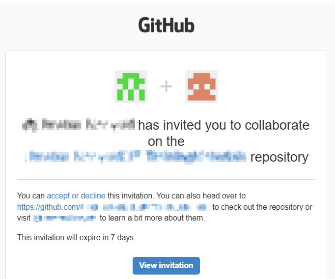
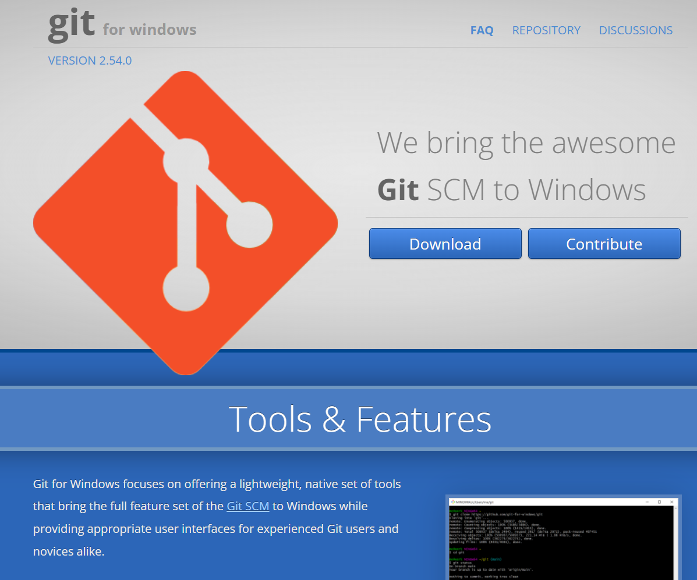
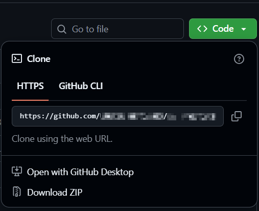

[[ メニューに戻る ]](README.md)

# 全エンジニア共通知識_S0101Git-基礎編

## 1. この資料の目的
基本 GitHub + VSCode を使い、以下の流れを自力で回せるようになることを目的とする。  
必ず Gitコマンド を添えることで、後で VSCode からの離脱も可能とする。  

```plaintext
[ 基本フロー ]

  GitHub招待
    ↓
  clone
    ↓
  branch
    ↓
  commit
    ↓
  push
    ↓
  Pull Request( PR )
    ↓
  レビュー
```

# 2. Git / GitHubとは

## 2-1. Gitとは
Git は、ソースコードの変更履歴を管理するバージョン管理システムです。
* 誰が
* いつ
* 何を変更したか
を記録できます。

## 2-2. GitHubとは
GitHub は、Git を利用したソースコード共有サービスです。  
チーム開発では GitHub 上で Repository を共有し、複数人で開発を行います。

# 3. GitHub参加

## 3-1. GitHub招待
GitHub Organization や Repository に招待された場合、メールまたは GitHub 通知から参加します。  
以下は招待メールの例です。  
指定日数以内に「View invitation」ボタンを押すと、Repository に参加することができます。  
<div align="center"></div>

## 3-2. Gitインストール
Gitコマンド を利用するため、最初に Git をインストールします。  
本資料では以下環境を対象とします。
- 端末で使用する環境により下記よりひとつ選択
  - Windows
  - Mac
  - WSL( Windows Subsystem for Linux )
- VSCode拡張( 使用して開発する場合のみ )

### [ Windows ]
[Git for Windows https://gitforwindows.org/](https://gitforwindows.org/) を利用します。  
<div align="center"></div>

Git for Windows では下記の機能がまとめて導入されます。
- Gitコマンド
- Git Bash
- SSH

インストール後、`Git Bash` が利用可能になります。  
Windowsからは、この `Git Bash` コマンドを利用した操作が基本となります。

```bash
$ git --version
```

### [ Mac ]
Mac は Homebrew 利用が一般的です。
```bash
$ brew install git
$ git --version
```

### [ WSL ]
WSL( Ubuntu / Debian 等 )では apt を利用します。
```bash
$ sudo apt update
$ sudo apt install -y git
$ git --version
```

### [ VSCode拡張 ]
インストールした Gitコマンドを VSCode 側が利用します。  
VSCode は Git を自動検出することが多いですが、検出されない場合、以下を確認してみてください。  
- VSCode 再起動
- PC再起動
- Gitのパスが PATH に反映されているかどうか
- Git再インストール

## 3-3. Repository clone
Repository をローカルへ複製します。  

### GitHub の Clone URL取得
GitHub の Repository 画面右上にある `Code` ボタンから、clone 用 URL を取得できます。  
HTTPS は最も一般的な接続方法です。最初のうちは HTTPS で問題ありません。  
<div align="center"></div>

### [ Gitコマンド ]
Repository をローカルへ複製します。  
通常は、作業したいディレクトリで clone を実行します。
```bash
$ cd {作業ディレクトリ}
$ git clone https://github.com/xxxxx/xxxxx.git
```

### [ VSCode ]
```plaintext
ソース管理
↓
Clone Repository ボタン
( ボタンが表示されない場合 Ctrl+Shift+P > `Git: Clone` )
↓
URL貼り付け
```

# 4. branch操作

## 4-1. branchとは
branch は、作業を分岐するための仕組みです。  
通常は main や master へ直接作業せず、作業用 branch を作成して開発します。

## 4-2. branch作成

### [ Gitコマンド ]
```bash
git switch -c feature/sample
```

旧形式:
```bash
git checkout -b feature/sample
```

### [ VSCode ]
```plaintext
左下 branch名
↓
Create New Branch
```

## 4-3. branch確認

### [ Gitコマンド ]
```bash
git branch
```

現在 branch:
```plaintext
* feature/sample
```

# 5. commit操作

## 5-1. add
変更ファイルを commit 対象へ追加します。

### [ Gitコマンド ]
```bash
git add .
```

特定ファイル:
```bash
git add sample.txt
```

### [ VSCode ]
```plaintext
Source Control
↓
＋ボタン
```

## 5-2. commit
変更履歴を保存します。

### [ Gitコマンド ]
```bash
git commit -m "sample commit"
```

### [ VSCode ]
```plaintext
Source Control
↓
message入力
↓
Commit
```

# 6. push操作

## 6-1. push
GitHub へ変更を送信します。

### [ Gitコマンド ]
```bash
git push
```

初回 branch:
```bash
git push -u origin feature/sample
```

### [ VSCode ]
```plaintext
Source Control
↓
Sync Changes
```

## 6-2. push失敗
よくある例:
```plaintext
failed to push some refs
```
他メンバー更新との差異が原因の場合があります。  
その場合は pull 後に再 push します。
```bash
git pull
git push
```

# 7. Pull Request( PR )

## 7-1. PRとは
Pull Request( PR )は、変更内容レビューを依頼する仕組みです。  
通常は 作業branch 上で修正を行い、PR を通して main or master へ変更を取り込みます。

## 7-2. PR担当者対応
PR担当者側には以下フローがあります。
```plaintext
初回 PR作成
       ↓
適宜 review指摘対応
       ↓
最後 conflict対応
```

## [ 初回 PR作成 ]
GitHub 画面を操作し、PRを作成します。
```plaintext
push後に表示される
「Compare & pull request」ボタン押下
 ( GitHub画面上部に現れます )
       ↓
PRで各種内容を登録
- merge先branch
  ( 通常は main or master など )
- PRタイトル
- 内容入力
- 右側にある下記も一緒に設定
    - reviewer: Review担当者
    - assignee: PR対応担当者
       ↓
「Create pull request」ボタン押下
```
※ reviewer や assignee は後から設定変更もできます。

## [ 適宜 review指摘対応 ]
GitHub やメール通知で review 指摘を受けた場合、  
GitHub の PR画面を表示し、指摘内容を確認します。
```plaintext
GitHub / メール通知
       ↓
GitHub画面 / PR画面表示
       ↓
GitHub画面 / review指摘確認
       ↓
作業 / ソースコード修正
       ↓
作業 / commit
       ↓
作業 / push
( push後は PR に変更内容が自動反映されます )
       ↓
GitHub画面 / review指摘へのコメント対応
```

### [ 最後 conflict対応 ]
同じ箇所を複数人が変更した場合、競合( conflict )が発生します。
```plaintext
<<<<<<< HEAD
現在変更
=======
相手変更
>>>>>>> branch
```
基礎編では、「発生するもの」と認識できれば十分です。  
詳細対応は 次章( 復旧編 ) で扱います。

## 7-3. review依頼対応
Review担当者側には以下フローがあります。
```plaintext
初回 review
       ↓
適宜 review管理( 担当者pushの度に )
       ↓
最後 merge対応
```

### [ 初回 review ]
GitHub やメール通知で review 依頼を受けた場合、  
GitHub の PR画面を表示し、依頼内容を確認します。  
```plaintext
GitHub画面 / PR表示
       ↓
GitHub画面 / 「Files changed」表示
       ↓
GitHub画面 / 対象箇所へ comment追加
( この時点では相手へ未送信 )
       ↓
GitHub画面右上 / 「Review changes」
review種別を選択
  - Comment: コメントのみ
  - Request changes: 修正依頼
  - Approve: review承認
    ⇒ 問題ない変更として承認する
       ↓
「Submit review」
```

### [ 適宜 review管理 ]
PR担当者の修正 push 後は、必要に応じて comment返信 や Resolve conversation を行います。
```plaintext
PR担当者 / review指摘確認
       ↓
PR担当者 / 修正
       ↓
PR担当者 / push
       ↓
GitHub画面 / review comment返信
       ↓
GitHub画面 / review comment右下「Resolve conversation」
```
`Resolve conversation` を行うことで、対応済み review 指摘として完了扱いにできます。

---

### [ 最終 merge対応 ]
review 完了後、PR を merge します。
```plaintext
GitHub画面 / review承認( Approve )確認
↓
GitHub画面 / 「Merge pull request」
↓
GitHub画面 / 「Confirm merge」
```
通常は review担当者や管理者が merge を行います。  
ただし conflict 発生時は、  
修正内容を理解している PR担当者側が merge 対応する場合が多いです。

mergeの方法には以下の2種類があり、画面上で選択することが可能です。  
- merge: 複数commit をそのまま merge
- squash merge: 複数commit を 1commit にまとめて merge
  ⇒ 履歴を綺麗に保ちやすい

# 10. stash
現在の変更内容を一時退避する機能です。  
作業途中で、
- 別branch確認
- レビュー対応
- 緊急修正
- pull実施
などを行いたい場合によく利用します。  

もっとも簡単なコマンド例
```bash
git stash           # 一時退避
git stash pop       # 戻す( 適用して削除 )
```

## [ 実際の利用例 ]
以下は作業途中で別branch確認を行いたい場合の例です。
```plaintext
[ stash退避フロー ]

  作業中
  ( 差分があるため branch切替できない場合がある )
    ↓
  s1. stash退避
  ( 作業内容を stash領域へ、内部的にcommitに近い形で一時保存 )
    ↓
  作業先 branchへ切替
   作業
  作業中だった branchへ切替
    ↓
  s2. stash適用
    ↓
  作業再開
```

### [ s1. stash退避 ]
```bash
git stash push -m "作業メモ"
```

### [ 作業先 branchへ切替 ]
VSCodeでbranch切り替えて、作業を行う

### [ 作業中だった branchへ切替 ]
VSCodeでbranch切り替え

### [ s2. stash適用して削除まで ]
```bash
git stash list              # stash確認
git stash show -p stash@{0} # stash差分確認 `-p` は 差分内容を表示する patch の意味
git stash apply stash@{0}   # stash適用
git stash drop stash@{0}    # stash削除
```

### [ popについて ]
```bash
git stash                   # 一時退避
git stash pop               # 戻す( 適用して削除 )
```
`pop` は `apply` と `drop` を合わせた機能で 便利ですが、  
```plaintext
apply
↓
成功したら
drop
```
conflict時に状態が分かりづらくなる場合があります。

そのため実務では、
```plaintext
apply
↓
確認
↓
drop
```
と分けて利用する方が安全です。

# 11. 基本ルール
* main/master へ直接 push しない
* branch を切って作業する
* PR を通して merge する
* push 前に branch を確認する
* pull 後に push を意識する
* commit message を分かりやすくする

[[ このページの先頭に戻る ]](#) [[ メニューに戻る ]](README.md)
