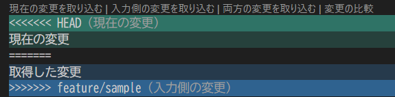

[[ メニューに戻る ]](README.md)

# 全エンジニア共通知識_S0102 Git-復旧編

## 1. この資料の目的
この資料は、Git / GitHub 操作でミスやトラブルが起きた時に、  
作業内容を壊さず、安全に復旧するための基礎を学ぶ資料です。

Git は変更履歴を管理する仕組みですが、操作を誤ると、  
「どの変更が残っているのか」「どこまで戻してよいのか」が分かりにくくなることがあります。

そのため、この資料では、まず状況を確認し、必要な変更を守りながら復旧する考え方を扱います。

## 2. 復旧操作の基本方針
現在の状態を確認し、  
- commit済か？
- push済か？
で対応を分けます。
```plaintext
commit済？
    ├─ No  ⇒ local変更修正
    │
    └─ Yes
         ↓
       push済？
         ├─ No  ⇒ local履歴修正
         └─ Yes ⇒ GitHub共有後復旧
```
- commit済 ... Git に履歴保存された状態
- push済 ... GitHub へ共有済の状態
Git の復旧操作は、  
現在の状態によって、使用する考え方やコマンドが変わります。

そのため、この資料では、commit状態 / push状態 に応じて、  
以下の内容を中心に扱います。
| 内容 | commit前, push前 | commit済, push前 | commit済, push済 | 章 |
|---|---|---|---|---|
| GitHub側<br>変更取り込みconflict | 変更取り込みconflict<br>　fetch, pull | 変更取り込みconflict<br>　fetch, pull | - | 4-1 |
| PR merge時の<br>conflict | - | merge時conflictを解消<br>　merge | conflictを解消<br>　revert | 4-2 |
| branch間違い | branch移動<br>　switch<br><br><br> | branch間commit移動<br>　switch, cherry-pick<br><br><br> | branch間commit移動<br>　switch, cherry-pick<br>push済commitを取り消す<br>　revert | 5章 |
| commit修正 | - | 直前commitを修正<br>　amend | push済commitを取り消す<br>　revert | 6章 |
| 履歴整理 | - | local履歴を戻す<br>　reset | push済commitを取り消す<br>　revert | 7章 |
| 過去履歴復旧 | - | 操作履歴から復旧<br>　reflog, reset | - | 8章 |
| commit移送 | - | commitを別branchへ適用<br>　cherry-pick | commitを別branchへ適用<br>　cherry-pick | 9章 |
| 一時退避 | 作業内容を一時退避<br>　stash | 作業内容を一時退避<br>　stash | - | S0101参照 |

## 3. 確認コマンド
現在の状態を確認し、  
commit状態 / push状態を確認するためのコマンドです。

```bash
# 現在の branch、変更中のファイル、commit 前の変更があるかを確認
$ git status
On branch feature/sample               # 現在作業中の branch

Changes not staged for commit:         # 未commit変更が存在
  modified: sample.txt                 #   ファイル名も判明

# 今どの branch にいるかを確認
$ git branch
* feature/sample                       # 現在作業中の branch
  main

# commit の流れと branch の位置を確認
$ git log --oneline --graph --decorate --all
* a1b2c3d (HEAD -> feature/sample)     # HEADが現在作業中の branch
| * e4f5g6h (origin/main)              # GitHub側 main branch の最新位置
|/
* z9y8x7w                              # branch分岐元

# Remote環境( GitHub )の接続先を確認
$ git remote -v
origin  https://github.com/example/sample.git (fetch)   # origin が GitHub 接続先
origin  https://github.com/example/sample.git (push)    # origin が GitHub 接続先

# HEAD の最新操作履歴を確認
$ git reflog
a1b2c3d HEAD@{0}: commit: fix login bug                 # 最新操作履歴
z9y8x7w HEAD@{1}: reset: moving to HEAD~1               # reset操作履歴
e4f5g6h HEAD@{2}: checkout: moving from main to feature/sample
c3d4e5f HEAD@{3}: commit: add sample function
```

## 4. conflict対応

### 4-1. pull前の fetch確認
GitHub 上の最新変更を取得する際に、`fetch` と `pull` を使用します。

#### [ fetch ]
Remote環境( GitHub )の最新情報だけ取得します。  
現在の作業内容は変更されません。
```bash
# GitHub の最新情報を取得
#     ↓
#   まだ merge はしない ⇒ 安全に差分確認できる
$ git fetch
```

#### [ pull ]
Remote環境( GitHub )の最新情報を取得し、現在の branch に反映します。
```bash
# GitHub の最新情報を取得
#     ↓
#   自動 merge ⇒ conflict が発生する場合がある
$ git pull
```

#### [ まず fetch が安全 ]
GitHub側の変更を取り込む際は、  
conflict や意図しない merge が発生することがあります。

特に、  
- pull 時
- branch merge 時
- PR merge 時

などで発生することがあります。

そのため、まず `fetch` で差分確認する方が安全です。
```bash
$ git fetch
$ git log --oneline --graph --decorate --all
```

### 4-2. conflictとは
同じ箇所を別々に変更した場合、  
Git が自動 merge できず、conflict が発生します。

#### [ 発生時の対応の流れ ]
```plaintext
1. conflict発生
   CONFLICT (content): Merge conflict in sample.txt
   ↓
2. conflict が発生したファイルを確認しながら修正
   修正後は通常通り add / commit

   <<<<<<< HEAD
   現在の変更
   =======
   取得した変更
   >>>>>>> feature/sample
```

### 4-3. 修正方法

#### [ 基本の修正方法 ]
conflict は「どの変更を残すか」を人間が判断して修正します。
```plaintext
<<<<<<< HEAD
現在の変更
=======
取得した変更
>>>>>>> feature/sample
```
不要な行を削除し、  
最終的に残したい内容へ修正します。

修正後は通常通り、以下の操作を実施します。
```bash
$ git add .
$ git commit
```

#### [ VSCodeでの対応 ]
対象ソースの conflict 箇所上部に、解消用の選択肢が表示されます。  
初心者は、まず「変更の比較」で内容を確認してから、残す変更を選ぶと安全です。

<div align="center"></div>

| 表示 | 意味 | 使う場面 |
|---|---|---|
| 現在の変更を取り込む( Accept Current Change ) | 現在の branch 側の変更を残す | 自分側の変更を優先する場合 |
| 入力側の変更を取り込む( Accept Incoming Change ) | 取り込み元の変更を残す | 相手側・main側の変更を優先する場合 |
| 両方の変更を取り込む( Accept Both Changes ) | 両方の変更を残す | 両方必要な場合 |
| 変更の比較( Compare Changes ) | 差分を比較して確認する | どちらを残すか判断したい場合 |

迷った場合は、いきなり選択せず、  
`Compare Changes` で差分を確認してから修正します。

修正後は通常通り、以下の操作を実施します。
```plaintext
ステージング
↓
commit
```

#### [ GitHubでの対応 ]
GitHub の PR merge 時も、Web画面上で conflict 修正できる場合があります。  
この場合、VSCodeと同じように GUIで変更を選択しながら修正できます。  
また、GitHub上で直接修正するため、通常 push 操作は不要です。

## 5. branch を間違えた時
作業中に、  
「別branchで作業していた」  
「main へ commit してしまった」  
など、branch を間違えることがあります。

まず、  
- commit 前か
- commit 後か
- push 済みか

を確認し、対応を分けます。

### 5-1. commit 前の場合
まだ commit 前であれば、  
変更内容を保持したまま branch 移動できます。
```bash
$ git switch {branch name}
````

```plaintext
現在branch
↓
switch
↓
変更内容を保持したまま移動
```

### 5-2. commit 後の場合
誤った branch で commit した場合は、  
正しい branch へ commit を移動します。
```plaintext
誤branchでcommit
↓
正branchへcommit移動
↓
誤branch側を戻す
```

#### [ commit移動 ]
正しい branch へ commit を移動する際は、
`cherry-pick` を使用します。
```bash
$ git cherry-pick {commit id}
```
※ 詳細な使用方法は 9章 を参照してください。

#### [ 元branchを戻す ]
```bash
$ git reset --hard HEAD~1
```


### 5-3. push 済みの場合
push 済み branch を `reset` すると、  
他メンバーとの履歴不整合が発生する場合があります。

そのため、  
GitHub共有後は、基本的に `revert` を使用します。
```bash
$ git revert {commit id}
```

```plaintext
commitを消す
ではなく
↓
取り消しcommitを追加
```
履歴を壊さず、安全に修正できます。

なお、`revert` は誤った commit を取り消す操作です。  
正しい branch へ修正内容を反映する場合は、  
その後あらためて修正し、通常通り commit / push します。
```plaintext
revert
↓
正しい branch へ修正
↓
commit
↓
push
```

## 6. commit を間違えた時
commit 後に、  
- commit message を間違えた
- add 漏れがあった
- 不要なファイルを含めた

などに気づくことがあります。

まず、  
- push 前か
- push 後か

を確認し、対応を分けます。

### 6-1. push 前の場合
push 前であれば、 
`amend` を使用して直前 commit を修正できます。

#### [ commit message 修正 ]
直前の commit message を修正します。
```bash
$ git commit --amend -m "{message}"
```

```plaintext
直前commit
↓
messageだけ修正
```

#### [ add 漏れ修正 ]
直前commitへ追加できます。
```bash
$ git add .
$ git commit --amend
```

```plaintext
add漏れ
↓
amend
↓
直前commitへまとめ直す
```

### 6-2. amend の注意点
`amend` は、  
既存commitを直接編集するのではなく、  
「新しい commit として作り直す」操作です。

そのため、  
push 済み commit に対して使用すると、  
他メンバーとの履歴不整合が発生する場合があります。

```plaintext
既存commitを書き換える
ではなく
↓
commitを作り直す
```

基本的に、  
`amend` は push 前のみ使用します。

### 6-3. push 済みの場合
push 済み commit を修正したい場合は、  
基本的に `revert` を使用します。
```bash
$ git revert {commit id}
```

```plaintext
push済commit
↓
revert
↓
取り消しcommit追加
```
履歴を壊さず、安全に修正できます。

なお、`revert` は誤った commit を打ち消す操作です。  
正しい内容へ修正する場合は、`revert` 後にあらためて修正し、通常通り commit / push します。
```plaintext
revert
↓
正しい内容へ修正
↓
commit
↓
push
```

## 7. 履歴を戻したい時
Git では、  
- push 前の local履歴整理
- GitHub共有後の履歴取り消し
で、使用する操作が変わります。

まず、
- push 前か
- push 後か

を確認し、対応を分けます。

### 7-1. push 前の場合
local作業だけであれば、  
`reset` を使用して履歴を戻せます。

#### [ soft ]
commitだけ戻します。
```bash
$ git reset --soft HEAD~1
````

```plaintext id="jlwm1102"
commit : 戻る
add    : 保持
変更   : 保持
```

#### [ mixed ]
add を解除します。

```bash
$ git reset HEAD~1
```

```plaintext
commit : 戻る
add    : 戻る
変更   : 保持
```

#### [ hard ]
変更自体を破棄します。
```bash
$ git reset --hard HEAD~1
```

```plaintext
commit : 戻る
add    : 戻る
変更   : 消える
```

#### [ hard の注意 ]
`hard` は変更自体を削除するため、  
未保存変更が消える場合があります。
```plaintext
hard reset
↓
変更自体が消える
```

特に、
push 済み履歴への使用は避けます。

### 7-2. push 済みの場合
GitHub共有後の履歴は、  
基本的に `revert` を使用します。
```bash
$ git revert {commit id}
```

```plaintext
過去commitを消す
ではなく
↓
取り消しcommitを追加
```
履歴を壊さず、安全に修正できます。

### 7-3. reset と revert の違い
```plaintext
reset
↓
履歴を戻す(local向け)

revert
↓
取り消しcommitを追加(GitHub共有後向け)
```
push 前は `reset`、  
push 後は `revert` を基本に考えると、安全に運用しやすくなります。

## 8. reflog で復旧する
Git では、  
`reset --hard` などを行うと、  
「commit が消えたように見える」ことがあります。

しかし実際には、  
Git内部に操作履歴が残っている場合があります。

その履歴を確認するのが `reflog` です。

### 8-1. reflogとは
HEAD の移動履歴を確認できます。
```bash
$ git reflog
```

```plaintext
a1b2c3d HEAD@{0}: commit: fix login bug
z9y8x7w HEAD@{1}: reset: moving to HEAD~1
e4f5g6h HEAD@{2}: checkout: moving from main to feature/sample
```

```plaintext
HEAD@{0}
↓
現在位置

HEAD@{1}
↓
1つ前の操作位置
```

### 8-2. よくある復旧パターン
特に多いのは、  
`reset --hard` 実行後に、  
「戻しすぎた」と気づくケースです。
```plaintext
間違えて reset --hard
↓
commit が消えたように見える
↓
reflog で過去位置確認
↓
元へ戻す
```

### 8-3. 復旧方法
戻したい位置を `reflog` で確認し、  
その位置へ reset します。
```bash
$ git reflog
$ git reset --hard HEAD@{1}
```

```plaintext
HEAD@{1}
↓
1つ前の状態へ戻す
```
復旧後は、`git status` や `git log` で、  
意図した状態へ戻っているか確認します。

### 8-4. reflog は最後の保険
通常の `log` では見えなくなった commit も、  
`reflog` から復旧できる場合があります。
```plaintext id="jlwm1206"
log では消えたように見える
↓
reflog には残っている場合がある
```
困った時は、  
まず `git reflog` を確認する習慣が重要です。

## 9. cherry-pick で commit を移動する
Git では、  
必要な commit だけ別branchへ移動したい場合があります。

特に、  
- 誤branchへ commit した
- 一部修正だけ main へ取り込みたい
などで利用します。

そのような場合に使用するのが `cherry-pick` です。

### 9-1. cherry-pickとは
指定した commit だけ、別branchへ適用します。
```bash
$ git cherry-pick {commit id}
```

```plaintext
branchA の commit
↓
branchB へコピーして適用
```

### 9-2. よくある利用例

#### [ 誤branch commit の移動 ]
```plaintext
誤branchでcommit
↓
正branchへ切替
↓
cherry-pick
↓
必要commitだけ移動
```

### 9-3. commit id の確認
適用対象の commit id は、`git log` で確認します。
```bash
$ git log --oneline
```

```plaintext
a1b2c3d fix login bug
z9y8x7w add sample function
```

```plaintext
a1b2c3d
↓
この commit を適用
```

### 9-4. conflict が発生する場合
cherry-pick 中も、  
通常 merge と同様に conflict が発生する場合があります。
```plaintext
別branch側にも変更が存在
↓
Git が自動 merge できない
↓
conflict発生
```

その場合は、  
4章 conflict対応 と同様に修正します。

### 9-5. cherry-pick の注意点
同じ commit を複数回適用すると、  
重複修正や conflict の原因になる場合があります。

そのため、  
「どの branch に適用済みか」  
を確認しながら利用することが重要です。

## 10. まとめ
Git の復旧操作では、  
まず「今どういう状態か」を確認することが重要です。

特に、  
- commit済か
- push済か

を意識することが重要です。

共有済み履歴は `revert`、  
ローカル整理は `amend` や `reset` を基本に考えると、安全に運用しやすくなります。

また、困った時は焦って操作せず、  
まず `git status` や `git log` で、  
現在の状態を確認してから操作する習慣が重要です。

[[ このページの先頭に戻る ]](#) [[ メニューに戻る ]](README.md)
