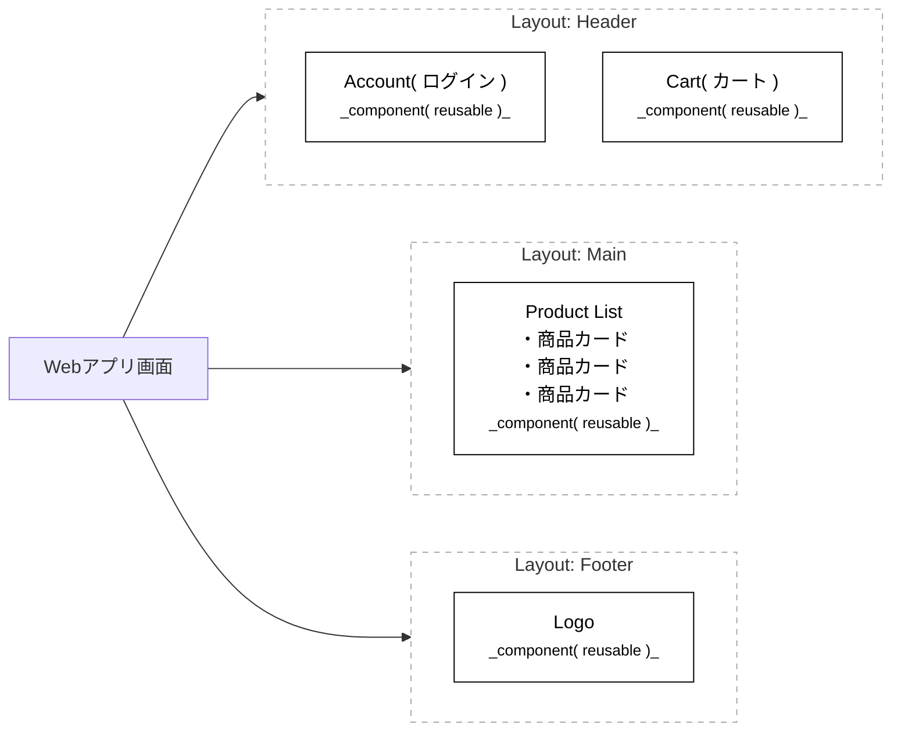

[[ メニューに戻る ]](社員のスキルアップ教育計画_00menu.md)

# フロント(主な言語とフレームワーク)
ユーザーとシステムの「接点」を構築する

## 1. フロントエンドとは？
Webサイトやアプリケーションにおいて、ユーザーが直接見て、触れる部分( UI: User Interface )のことです。  
現在は単に「表示する」だけでなく、**「ユーザー体験( UX )を最大化する」**ための高度な設計が求められています。

---

## 1.5 2026年のフロントエンド・トレンド
現在の開発では「ただ表示する」から「素早く、安全に、美しく提供する」ことが重視されています。
* **UIコンポーネントの再利用**: 同じボタンや入力フォームを何度も作らず、共通部品として管理する手法が主流です。
* **AIによるコード生成の活用**: 全てを自担で書くのではなく、AIにベースを作らせ、人間がそのロジックを検証・統合するスキルが求められています。

## 2. 三種の神器( 基礎中の基礎 )
まずはここからスタートします。これらはどんなに高度な技術に進んでも不変の基礎です。

* **HTML (HyperText Markup Language)**
    * 役割：ページの「骨組み・構造」を作る。( 例：ここは見出し、ここは画像 )
* **CSS (Cascading Style Sheets)**
    * 役割：ページの「見た目・装飾」を整える。( 例：色を青にする、ボタンを丸くする )
* **JavaScript (JS)**
    * 役割：ページに「動き・機能」を加える。( 例：ボタンを押したらメニューが出る、データを取得する )

---

## 3. モダン開発の主役：フレームワークとライブラリ
2026年現在、JavaScriptだけで大規模な開発を行うことは稀です。効率と保守性を高めるために以下のツールが使われます。

* **React (リアクト)**
    * 特徴：Meta( 旧Facebook )が開発。現在の世界標準。
    * メリット：「部品( コンポーネント )」ごとに分けて作るので、大規模開発でも管理がしやすい。
* **TypeScript (タイプスクリプト)**
    * 特徴：JavaScriptに「型( ルール )」を追加したもの。
    * メリット：開発中のミスをAIやエディタが即座に指摘してくれるため、バグが激減する。
* **Next.js (ネクストジェイエス)**
    * 特徴：Reactをベースにしたフレームワーク。
    * メリット：表示速度が速く、SEO( 検索エンジン最適化 )に強い。現在の企業のWebアプリ開発の標準的な選択肢です。

> 重要：  
> Reactでは「画面」ではなく「部品( コンポーネント )」の組み合わせでUIを作ります。  
> 同じ見た目・役割のものは「同じ部品」として再利用します。  

## 3.5 デザインシステムとエンジニアの連携
企画・デザイナーが作った意図を正確に反映するために、以下の概念が重要です。

* **Figma (フィグマ)**: デザイン共有ツール。ここからAIを使ってコードを抽出する流れが一般的です。
* **Storybook (ストーリーブック)**: 作成したコンポーネントをカタログのように一覧管理するツール。

---

## 4. 企画・ビジネス視点でのチェックポイント
エンジニアと会話する際に、以下のキーワードを知っておくとスムーズです。

* **レスポンシブデザイン**: PCでもスマホでも綺麗に見えるようにすること。
* **API連携**: フロントエンド( 画面 )から、バックエンド( データサーバー )へ情報をリクエストする仕組み。
* **SPA (Single Page Application)**: ページ遷移時に画面が白くならず、アプリのようにサクサク動くWebサイトの形態。

---

## 5. 学習者用：AIを「フロントエンド講師」にするテンプレート
このテキストをメモした上で、AIにこう問いかけて学習を開始しましょう。

### 【AIへの指示例】
> 「私は今、フロントエンドの基礎を学んでいます。
> 1. まず、**HTMLだけで作ったWebサイト**と、**JavaScriptを加えたWebサイト**で何ができるようになるのか、具体例を3つ出してください。
> 2. その後、私が理解できたか確認するために、簡単な穴埋め問題を1問出してください。
> 3. 正解できたら、次のステップとして『React』がなぜ必要なのか、料理の工程に例えて教えてください。」

[[ このページの先頭に戻る ]](#) [[ メニューに戻る ]](社員のスキルアップ教育計画_00menu.md)  
